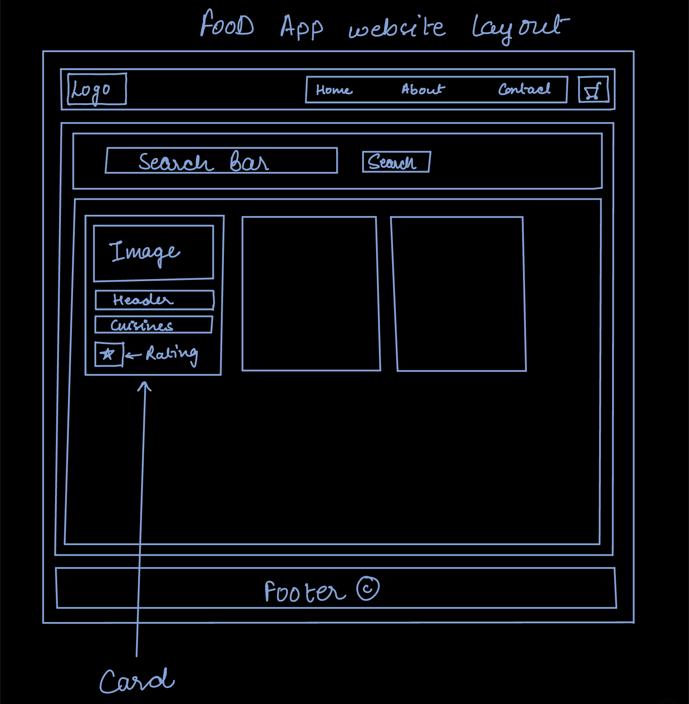

# FoodApp

    <h1> Commands </h1>
    <ul>
        <li>To run the dev build -- npm startDev </li>
        <li>To run the production build -- npm startBuild</li>
    </ul>

    <h1>To construct this app </h1>
    <h3>For the basic understanding of the website, you can take the reference from the <strong><a href="./website_layout.jpg">website_layout.jpg</a></strong></h3>
    
    
To construct this app you need some dependencies like parcel, react, react-dom, browserlists, etc. so run the commands given below to create this react app.

    <h2>To create app and install the dependencies and run these commands.</h2>
    <ul>
        <li>To start the react app: 
npm init -y
</li>
        <li>To install react: 
npm i react 
</li>
        <li>To install react-dom: 
npm i react-dom 
</li>
        <li>To install parcel: 
npm i parcel 
</li>
        <li>To install browserlist: 
npm i browserlist
</li>
        <li>Create app.js file: 
touch app.js
</li>
        <li>Create index.html file: 
touch index.html 
</li>
        <li>Create git ignore file: 
touch .gitignore 
</li>
    </ul>
    <h2>After installing all these dependencies and creating these files, do these following changes in the package.json </h2>
    <ul>
        <li>In the package.json file go to the script section add the dev start and production start
            

                "script":{
                    "startDev":"parcel index.html",
                    "startBuild":"parcel build index.html"
                }
            

        </li>
        <li>Remove the "main" in the package.json</li>
        <li>To add browserlist to your code add the below statement in your code. 
            

                "browserslist": [
                    "last 2 versions"
                 ]
            

        </li>
        <li>
            

        </li>
    </ul>

